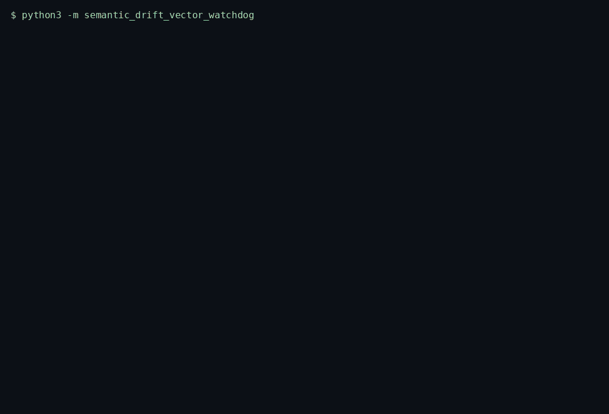
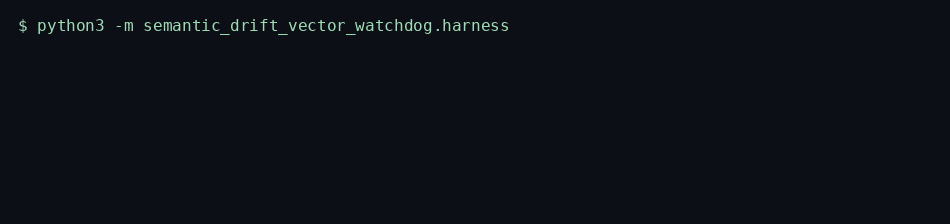
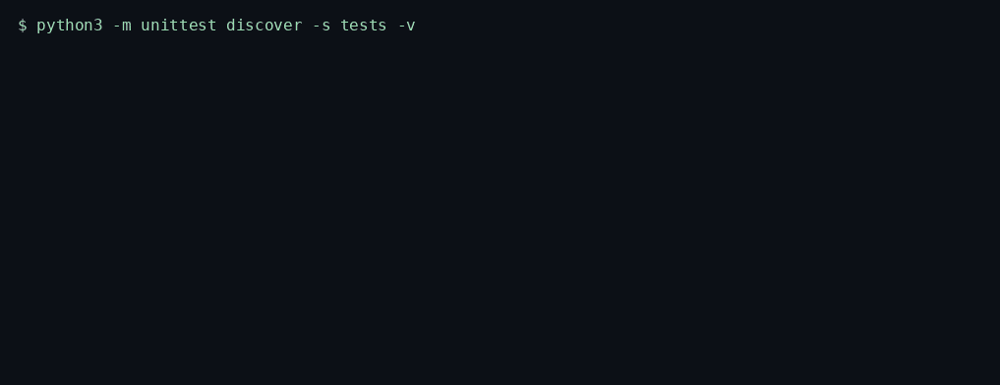

# Semantic Drift Vector Watchdog

> Tracks a 32-dimensional embedding centroid with Welford's method and raises drift when a two-sided CUSUM on cosine distance crosses its threshold.

<p>
  <a href="https://github.com/TechieGoku2623/semantic-drift-vector-watchdog/actions/workflows/ci.yml"></a>
  
  
</p>

| | |
| --- | --- |
| **Website** | https://github.com/TechieGoku2623/semantic-drift-vector-watchdog |
| **Topics** | `python` `asyncio` `machine-learning` `embeddings` `drift-detection` `generative-ai` |

## Walkthrough

Three recordings from this repository. Each one is the command in the frame, not a drawing.

### Engine

`python3 -m semantic_drift_vector_watchdog`



An all-zero vector raises. A near-orthogonal vector trips the CUSUM and stays out of the centroid.

### Benchmark

`python3 -m semantic_drift_vector_watchdog.harness`



5000 iterations, seed 20261002. The frame ends on the status line and `echo $?`.

### Tests

`python3 -m unittest discover -s tests -v`



Wire round-trip, the happy path, and both edge cases below.

## Pipeline

```
vector dim 32
  |
  v
finite? zero? ---- fail --> EngineKernelException
  |
  v
cosine distance vs Welford mean
  |
  v
CUSUM+ / CUSUM-
  |
  v
{cosine_distance, l2, cusum_pos, cusum_neg, drift}
```

## Quick start

```bash
python3 -m venv venv
source venv/bin/activate
pip install -e ".[dev]"
python -m semantic_drift_vector_watchdog
python -m semantic_drift_vector_watchdog.harness
python -m unittest discover -s tests -v
```

Python 3.12. The runtime is the standard library. `black` and `flake8` are the `dev` extra.

## Use it

```python
import asyncio

from semantic_drift_vector_watchdog import SemanticDriftVectorWatchdog


async def demo() -> None:
    engine = SemanticDriftVectorWatchdog()
    baseline = [0.0] * 32
    baseline[0] = 1.0
    result = await engine.run([baseline])
    print(result)


asyncio.run(demo())
```

## Bounds

| | |
| --- | ---: |
| Iterations | 5000 |
| Average | 71.155 µs |
| P99 | 110.891 µs |
| tracemalloc peak | 188088 bytes |

Figures are from the harness on the machine that published them. A later host moves the microseconds. The pass/fail result does not.

## What it refuses

- An all-zero vector raises `EngineKernelException` and does not move the centroid.
- A planted near-orthogonal vector drives cosine distance up until `drift` is set. That vector is withheld from the mean.

Scores caller-supplied vectors. It does not load model weights.

## Tree

```
src/semantic_drift_vector_watchdog/
  engine.py       kernel
  wire.py         struct frames
  harness.py      benchmark
  __main__.py     demo entry
tests/test_engine.py
Dockerfile        non-root, uid 10001
```
